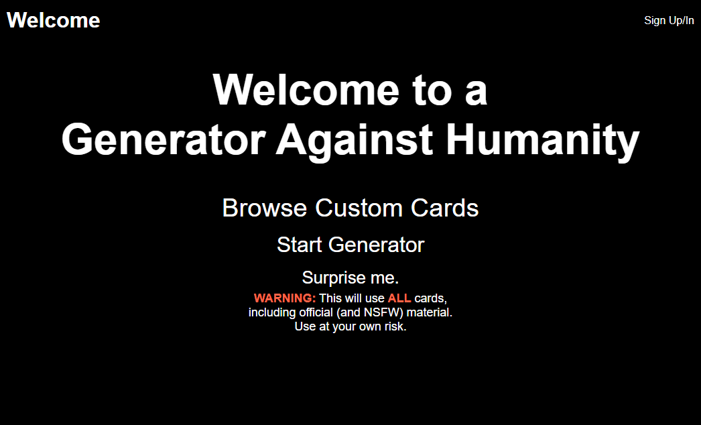
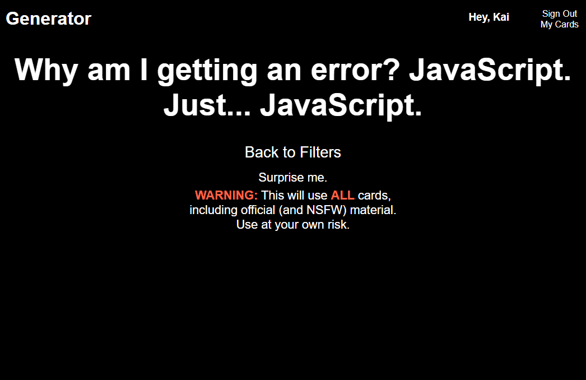
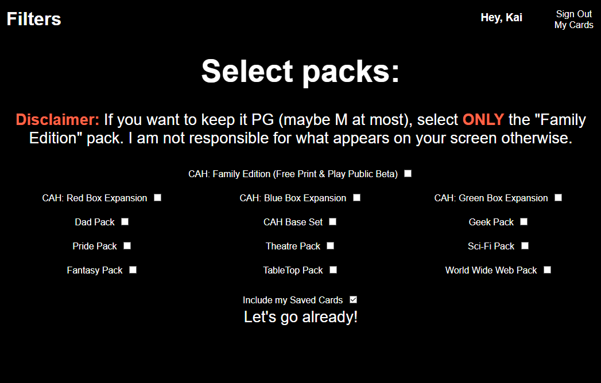
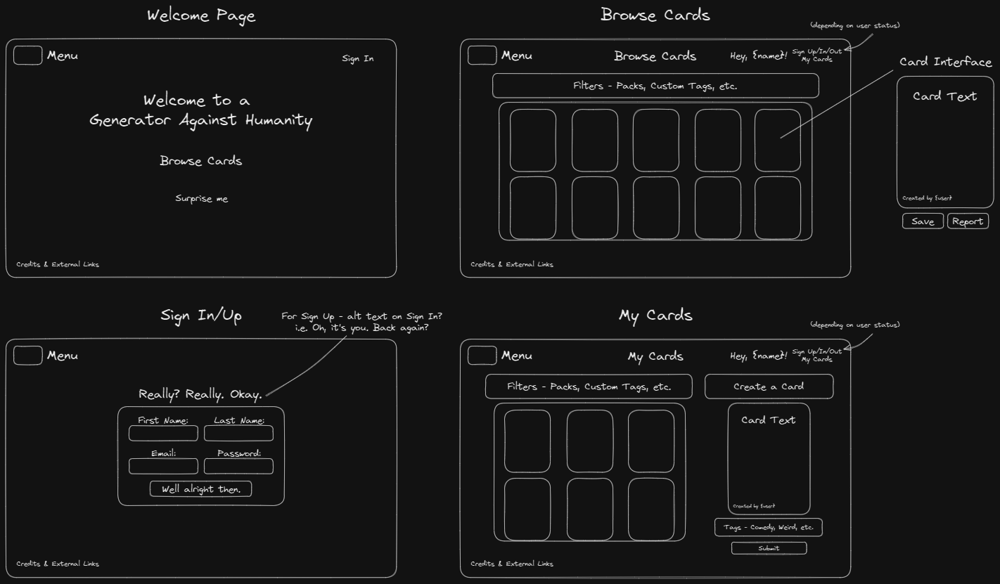
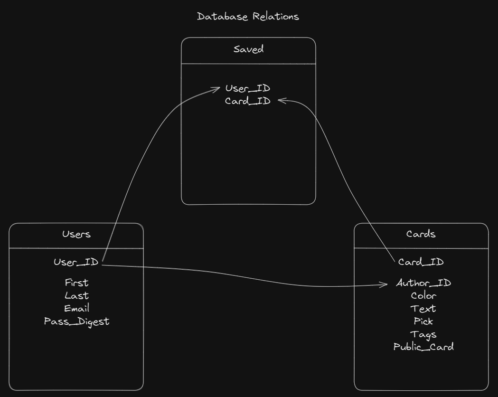

# Generator Against Humanity
**A web app**  
**based on a party game**  
**for horrible people.**  

> WARNING: If you aren't familiar with the original game, Cards Against Humanity contains some infamously offensive content. I have some options in place to hide said content, however I cannot guarantee full coverage.  
> 
> Proceed at your own risk.
## :computer: [Click here](https://generator-against-humanity.onrender.com/) to see my live project!
## :page_facing_up: About
For this project I have designed a web app where users can sign up to create, save and submit their own customised Cards Against Humanity, as well as save cards created by others. Users can also access a page where they can use their saved cards to generate randomised card combos and include officially published Cards through the REST Against Humanity API.

## :pencil: Planning & Problem Solving
- I started on this one by wireframing my essential pages (site landing, user sign-up/in, card browsers, etc.) Though as I was focused on implementing my CRUD requirements first, I neglected wireframing my generator pages. I definitely paid for this when I completed the CRUD with about two days to spare and had no time to really plan the generator.

- I also drafted some database relations so I knew what records were being referenced and where. For the most part this held up except for the tags, which I ended up scrapping for scoping purposes, but I would like to come back to those if I get the chance!

- When it came to the generator, my design process turned from scaffolded execution to a speed-run of Error-Driven Development. That said, this was still a good exercise as last-minute EDD will probably be a skill I'll be coming back to in my tech career.
- I also didn't scaffold my functions & dataflow at first either, so a lot of my functions came down to troubleshooting rather than planning. Definitely a lesson learned there!
## :floppy_disk: Cool tech
- Custom card creation & submission
- Browsing & saving of submitted custom cards
- SQL querying and interfacing with PostgreSQL
- The Flask framework used to display my web app
- CSS media querying to make it more accessible on mobile
- The REST Against Humanity API (by celsiusnarwhal at [this link](https://www.restagainsthumanity.com/2.x/)), used to import many officially published CAH decks.
- The generator itself! 
## :wrench: Bugs in the process :space_invader:
- I had to work through several bugs in the random generator and getting my returns and API returns uniform so they could merge effectively.
- Ran into a bug where saved cards created by others would still display as unsaved due to not referencing the user's saved cards on the page.
## :bulb: Lessons learnt
Things I learnt during development:
- Always, ALWAYS, scaffold the general dataflow and functions before I start writing code to save rewriting and excessive EDD.
- Being mindful of exactly what Jinja2 template if statements are checking and whether or not I've passed them through correctly. Especially with sessions and user data.
- How to troubleshoot SO MANY web dev errors. *So many.*
- Being mindful of my time and not over-commiting myself during a project period so I have time to better plan out my code & pages while readjusting where necessary.
## :clipboard: Future features
If I were to continue expanding on this as a side project, I would like to add:
- minor javascript additions to add interactive HTML elements (i.e. collapsible menus)
- implementing my original tags idea to allow filtering of custom cards for browser pages and the generator
- interaction to let players draw a hand of answer cards to use in the generator instead of randomly drawing at once
- (if I have the chance/time) a service to digitally play the game online with friends
